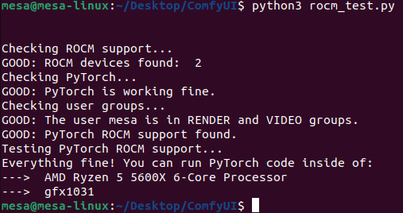
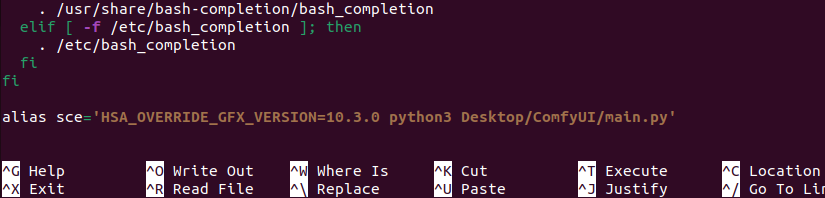
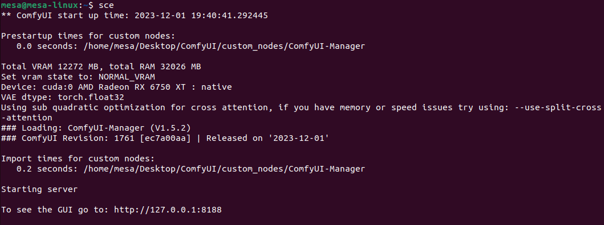

# ComfyUI Setup on AMD 6750-XT on Ubuntu

Ubuntu version I was using:

> lsb_release -a

Distributor ID:	Ubuntu  
Description:	Ubuntu 22.04.3 LTS  
Release:	22.04  
Codename:	jammy  

## Install pre-requisites:

In the terminal:

> sudo apt update && sudo apt install -y git python3.11 python3-pip python3-venv python3-dev libstdc++-12-dev rocminfo torch torchvision torchaudio --index-url https://download.pytorch.org/whl/rocm5.6

## Download AMD drivers

Download the latest from:
> https://www.amd.com/en/support/linux-drivers

In the terminal, replacing ###### with the version you downloaded:

> sudo dpkg -i amdgpu-install_##########_all.deb  
> sudo amdgpu-install --usecase=graphics,rocm 

Set the user rights:

> sudo usermod -a -G video $LOGNAME  
> sudo usermod -a -G render $LOGNAME

## First tests:

Using the python script from here:

https://gist.github.com/damico/484f7b0a148a0c5f707054cf9c0a0533

If we save the python script above as rocm_test.py, and run it, it should show:

## Install ComfyUI & ComfyUI-Manager

ComfyUI: https://github.com/comfyanonymous/ComfyUI

> git clone https://github.com/comfyanonymous/ComfyUI.git  
> cd ComfyUI  
> pip install -r requirements.txt

ComfyUI-Manager: https://github.com/ltdrdata/ComfyUI-Manager

> cd custom_nodes  
> git clone https://github.com/ltdrdata/ComfyUI-Manager.git  
> cd ..

## Quick-Start (Optional)

from the terminal:

> nano ~/.bashrc

at the end of the file add the following:

> alias sce='HSA_OVERRIDE_GFX_VERSION=10.3.0 python3 main.py"

sce for "start comfy env"

Ctrl+S (to save)  
Ctrl+X (to exit)

> source ~/.bashrc

## Start ComfyUI

If the rocm_test.py worked corectly (as in the image) then ComfyUI should work fully. Go to the ComfyUI folder:

> cd ComfyUI

If you did the optional step, from the terminal:

> sce

otherwise

> HSA_OVERRIDE_GFX_VERSION=10.3.0 python3 main.py

If you control-click on the http://127.0.0.1:8188 you should see the ComfyUI web-page.
